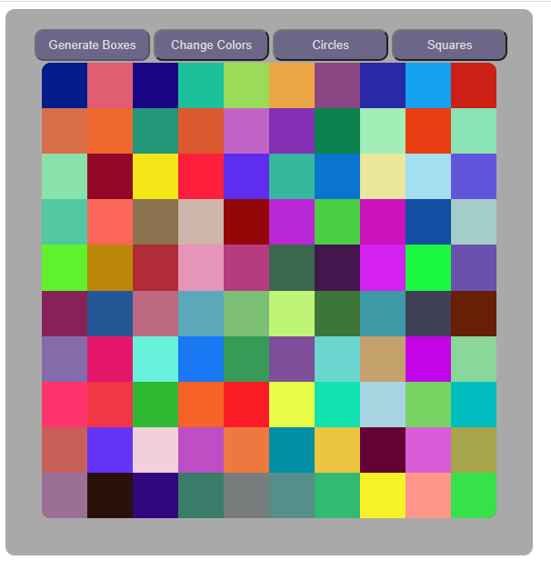

# [CSS Colored Squares](https://diuguide.github.io/css_grid_practice/)

[](LICENSE)
[](code_of_conduct.md)

A simple HTML, CSS, JavaScript Application that generates a grid of randomly colored squares.  The user can change the colors to other random colors, change the shape of the grid items to squares or circles. 



## Table of Contents

- [Usage](#usage)
- [Contributing](#contributing)
- [Questions](#questions)
- [License](#license)

## Usage

To use this app navigate to <https://diuguide.github.io/css_grid_practice/>.

1. To generate the grid, click ```Generate Boxes```.

1. To change the colors randomly, click ```Change Colors```.

1. To change the shape of the squares to circles, click ```Circles```.

1. To change the shape of the circles to squares, click ```Squares```.

1. To animate the color change, click ```Animate Colors```.

1. To stop the animation, either reload the page or click ```Stop Animation```.


[back to Table of Contents](#table-of-contents)

## Contributing

Your contribution is most welcome! Please refer to the contributing guidelines when making contributions to this project.

Please note that this project is released with a [Contributor Code of Conduct](code_of_conduct.md). By Participating in this project, you agree to abide by its terms.

[back to Table of Contents](#table-of-contents)


## Questions

Please reach out to me @ ```everett.diuguid@gmail.com``` with any questions regarding this project.

[back to Table of Contents](#table-of-contents)


## License

[MIT](LICENSE) copyright (c) 2020 Everett Diuguid.

[back to Table of Contents](#table-of-contents)
